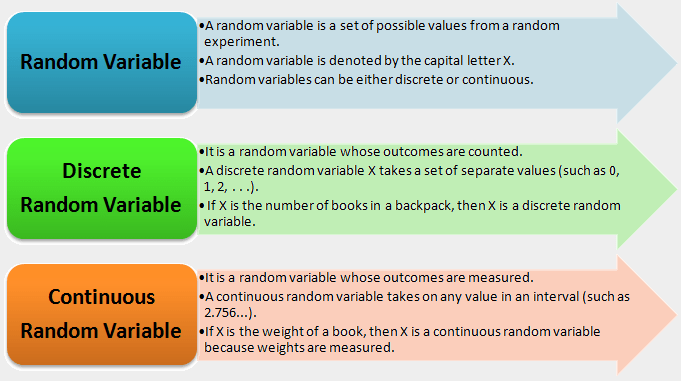
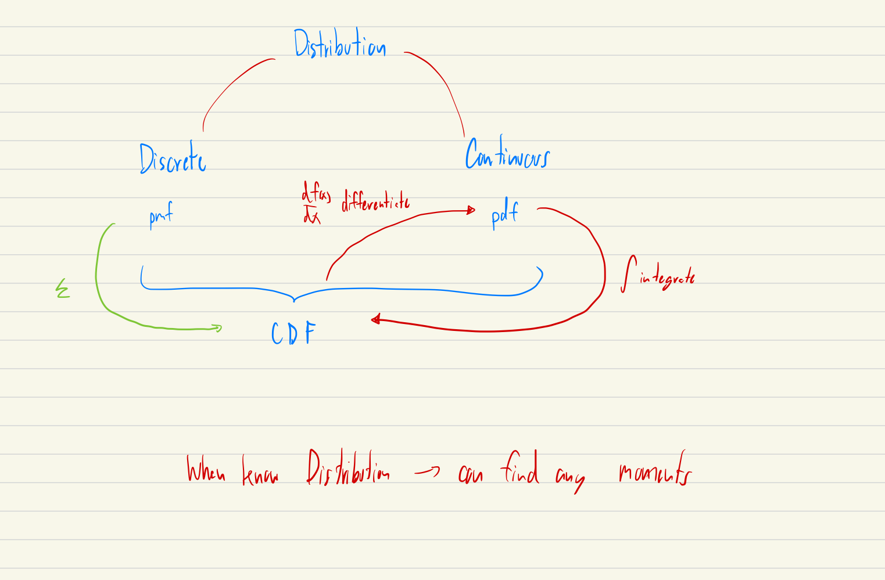
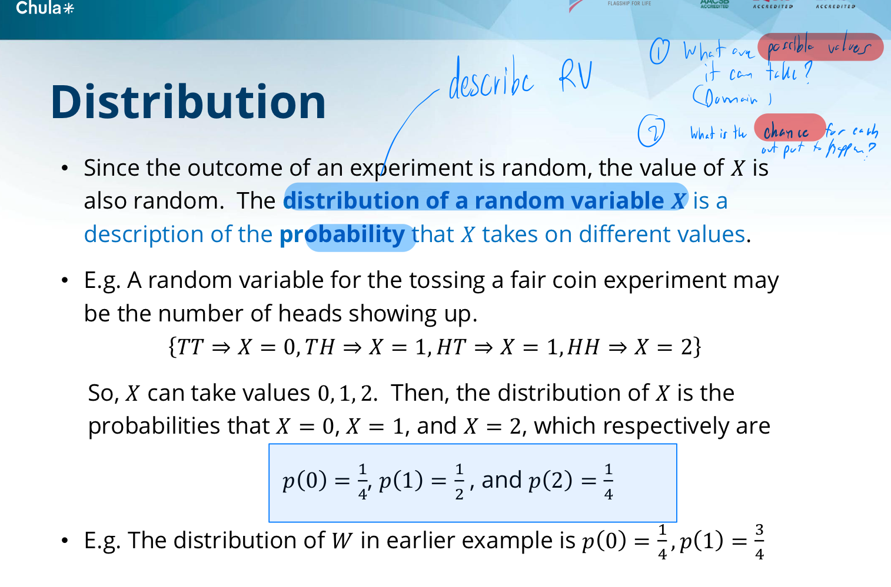
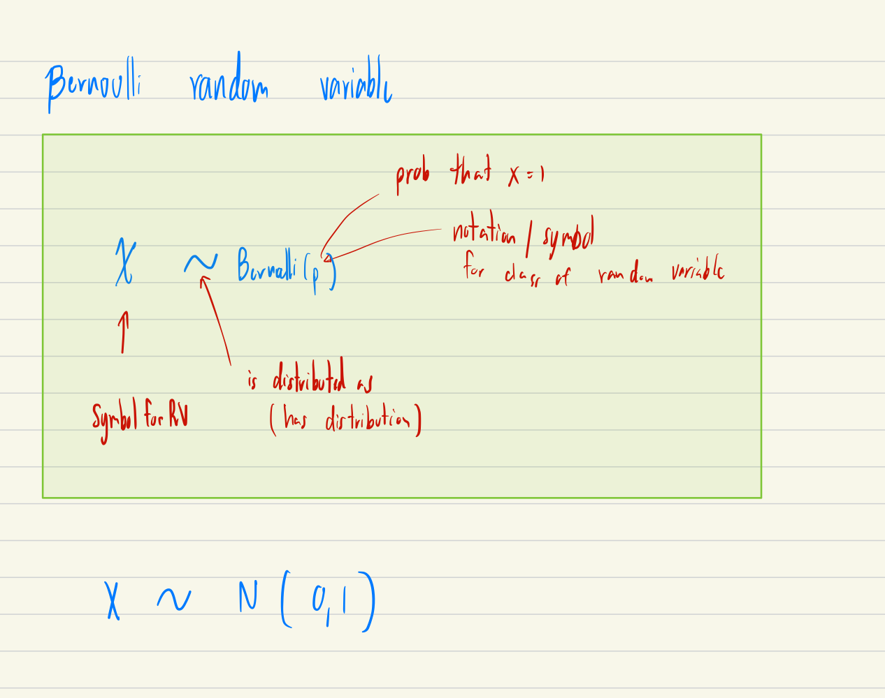
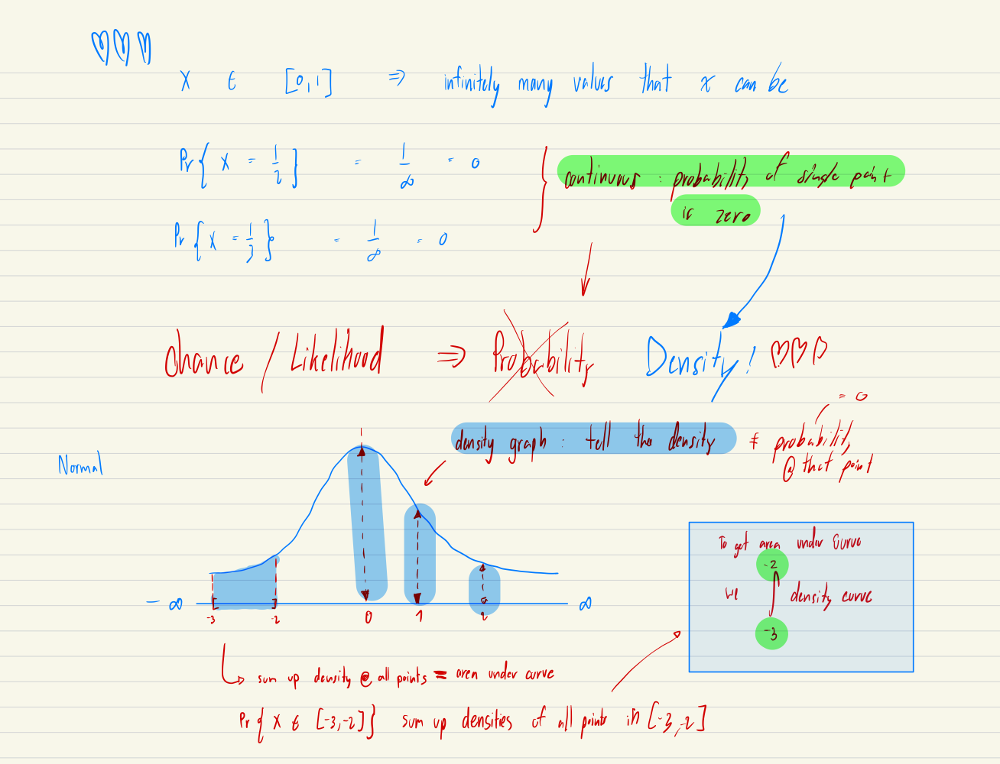
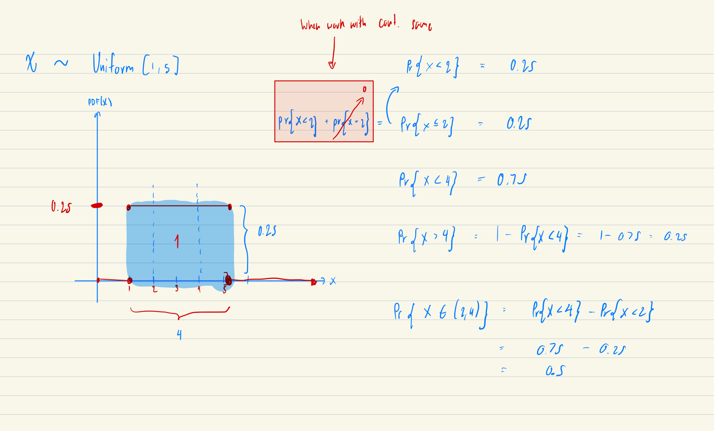
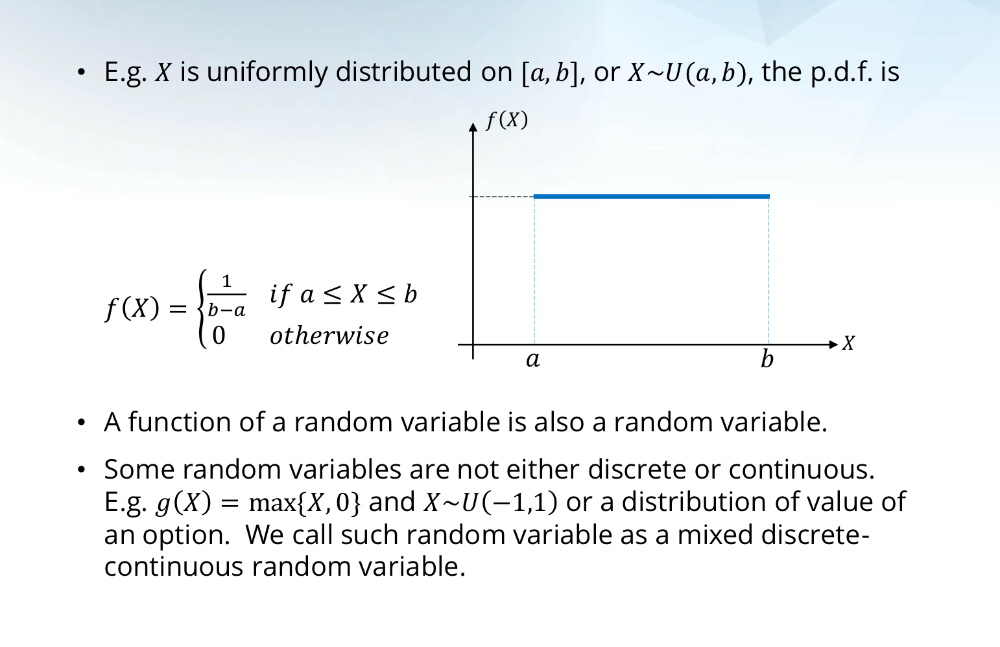
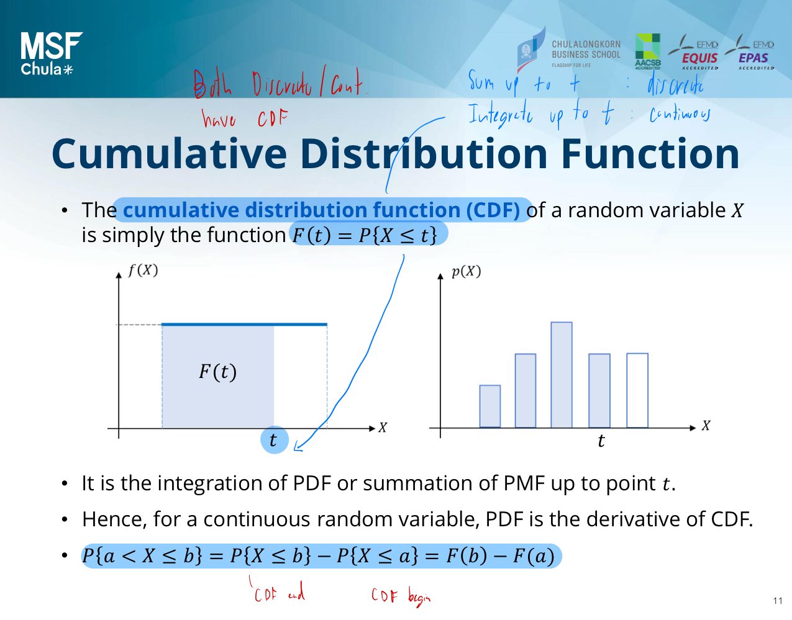
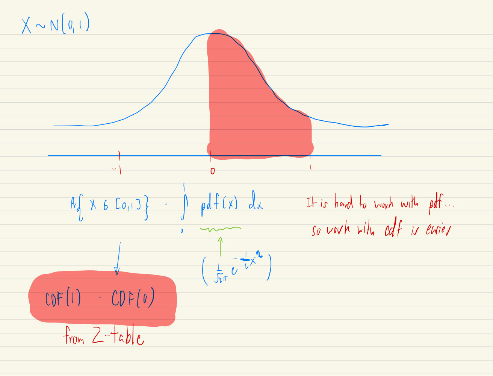

# Financial Econometrics Lecture 1: Probabilistic and Statistical Review

## Probabilistic Review Agenda 
### Random Variable
- Distribution (PMF,PDF,mixed,CDF,and Relationships)
- Expectation
- Variance
- Other Moments


### Random Vector
- Distribution 
- Expectation Revisit
- Law of Iterated Expectation
- Independence
- Mean Independence
- Covariance and Correlation

---

# 1.Random Variable: 

**Motivation:** Probability theory begins with idea from "Experiment" where output we don't know the outcome in advance. (Non-Deterministic: Random)

A **random variable** is **function** from **sample space** to set of real number. **It takes on numerical values which from experiment** (not known for certain in advance)

**Sample Space** = set of possible outcomes

**Example:**
-  **The experiment:** tossing a fair coin 2 times
- **Sample space:** {TT,TH,HT,HH} ==> It is not a number so it is hard to perform analysis and summarized result so we have to convert to RV (Non Number ==> Number)

1. Sample Space: before analysis define meaning
- Outcome ==> Number 

2. One experiment one output (functions) can have multiple RVs



#### Analogy

**Think of game Monopoly 🎲:**

The actual roll of dice is like our **"experiment"**
The possible outcomes (what you could roll) are your **"sample space"**
The number you get is your **"random variable"**

But here's the cool part - you can measure different things from the same roll!
Imagine you roll the dice once:

- count the total (2 to 12)
- count how many sixes you got (0, 1, or 2)
- even note if you got doubles (0 or 1)

**Each of these is a different random variable - a different way of turning the same roll (experiment) into useful numbers.**


It's a function that maps from the sample space to the real numbers.

When we roll two dice, our sample space Ω is the set of all possible outcomes:

Ω = {(1,1), (1,2), (1,3), ..., (6,6)}

A random variable X is a function that takes these outcomes and assigns them real numbers. We write this mathematically as:

X: Ω → ℝ (meaning X maps from the sample space to the real numbers)

It's like  

```
Python Function:

#Sample space

SS = (1,1), (1,2), (1,3), ..., (6,6)]

#Random Variable: Function with input list from sample space and output list of numerical numbers which go through functions

def Ω(for i in SS): --> {}  

Outputs: set of numerical outputs = Random Variables

```

---

## 1.1 Distribution:

**Distribution of random variable X is a description of the probability that X takes on different values**

- **By knowing distribution of random variables, we can find any moments (mean,std,skewness,kurtosis)**




**Main Questions**
```
1. What are the possible values that it takes? (Domain)
2. What is the chance for each output to happen? (Probability of each output)
```



### 1.1.1 Discrete Distribution: takes on only finite many (most countably many) different values 
- Tell probability at each point

### Probability Mass Function (PMF)
Let x₁, ..., xₖ denote the finitely many values that X can take on. The distribution is completely described by the probability with which X takes each value, called the probability mass function (PMF):

```
p(x) = P{X = x}
```

### Properties of PMF

#### 1. Non-Negativity
All probabilities must be non-negative:
```
p(x) ≥ 0 for all x
```

#### 2. Sum to One
The sum of all probabilities equals 1:
```
Σ p(xᵢ) = 1
```
where i goes from 1 to k

#### 3. Event Probability
For any set A, the probability is:
```
P{X ∈ A} = Σ I{xᵢ ∈ A}p(xᵢ)
```
where I{xᵢ ∈ A} is 1 if xᵢ is in set A, and 0 otherwise

### Example: Bernoulli Distribution
X is a Bernoulli random variable with parameter p:
```
X ~ Bernoulli(p)
```
- Equals 1 with probability p
- Equals 0 with probability 1-p

## Visual Representation
For a Bernoulli(0.7):
```
Value | Probability
------|------------
  0   |    0.3
  1   |    0.7
```

This clearly shows that:
1. All probabilities are ≥ 0
2. Probabilities sum to 1 (0.3 + 0.7 = 1)
3. We can find probability of any event (e.g., P{X = 1} = 0.7)




### 1.1.2 Continuous Distribution: takes on continuum of values, all number from [0,1]

- Focus on **density** not **probability**
- For example, a person's height could be 5.7231... feet, with infinitely many possible decimal places.
- One fascinating property of continuous random variables is that they have infinitely many possible values. Because of this, **the probability of getting exactly any specific value is actually zero!**

#### Probability Density Function (PDF)

The distribution of a continuous random variable is described by its probability density function, typically written as f(x). Think of the PDF as showing the "density" or "concentration" of probability at each point. While f(x) itself is not a probability, the area under the curve gives us actual probabilities.

#### Properties of PDF

The PDF must satisfy three key properties:

```
1. Non-negativity:
   f(x) ≥ 0 for all x
   (The density can never be negative)

2. Total area equals 1:
   ∫[from -∞ to ∞] f(x)dx = 1
   (Total probability must be 100%)

3. Probability of intervals:
   P{X ∈ A} = ∫[over set A] f(x)dx
   (Probability is the area under the curve)
```

#### Understanding the Third Property

The third property is particularly important. To find the probability that X falls in some interval A, we integrate the PDF over that interval. For example, if we want the probability that X is between a and b:

```
P{a ≤ X ≤ b} = ∫[from a to b] f(x)dx
```

This represents the area under the PDF curve between points a and b.

####    Real-World Example

Think of measuring human heights in a population. The PDF might look like a bell curve:
- The height of the curve at any point shows how "likely" values are around that point
- Taller parts of the curve indicate values that occur more frequently
- The total area under the curve must equal 1
- The probability of finding someone in a height range (say 5'8" to 5'9") is the area under the curve between those values







### 1.1.3 Mixed Discrete-Continuous Random Variables

- Function of random variable is a random variable
- Some RVs are not either discrete or continuous

Example g(X) = max{X,0} and X ~ U(-1,1) or distribution of value of an option

#### What Makes a Random Variable Mixed?

A mixed random variable combines both discrete and continuous components in its distribution. Imagine it as having some probability concentrated at specific points (like discrete spikes) and some probability spread continuously over intervals.

#### Real-World Example: Insurance Claims

Consider an insurance claim amount X:
- With probability 0.3, there is no claim (X = 0)
- When a claim occurs (probability 0.7), the amount follows a continuous distribution

This creates a mixed distribution because:
1. There's a discrete probability mass at X = 0
2. For X > 0, the distribution is continuous

#### Mathematical Representation

For a mixed random variable X, we need both:
1. A probability mass function (PMF) for discrete points
2. A probability density function (PDF) for continuous intervals

The complete probability distribution has this form:

```
P(X = x) = p(x)     for discrete points
P(a ≤ X ≤ b) = ∫[from a to b] f(x)dx     for continuous intervals
```

Where:
- p(x) gives probabilities for discrete values
- f(x) is the density function for continuous parts

#### Properties

The total probability must still equal 1:
```
Σ p(xᵢ) + ∫ f(x)dx = 1
```
Where:
- Σ p(xᵢ) sums over all discrete points
- ∫ f(x)dx integrates over continuous regions


### 1.1.4 Cumulative Distribution Function:

- The cumulative distribution function (CDF) of random variable X is simply the function **F(t) = P{X <= t}**
- It's the **integration of PDF** or **summation of PMF** up to point t
- **Continuous random variable, PDF is the derivative of CDF**
- `` P{a < X <= b} = P{X <= b} - P{X <= a} = F(b) - F(a)``



- Note: Sometime it is harder to with PDF so alternative is to use CDF instead for example integrate PDF of X~N(0,1) is not possible so we got to apply CDF property and estimate result using Z-table

