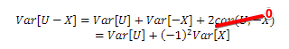
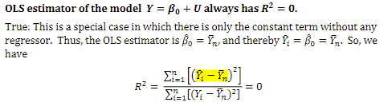
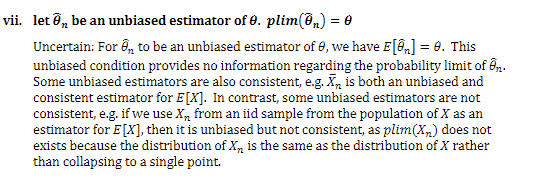

# Exercise Problem Set
#### Chanon Tungngeon ID:6784026426

## Question 1: True/False/Uncertain Statements
Analyze each statement assuming iid sample.

1. Let E[U|X]=3. U is mean dependent of X
   - **Answer**: FALSE
   - **Explanation**: Since E[U|X] is constant (=3) and doesn't vary with X, U is mean independent of X (not dependent)

2. Similar to the above Let E[U|X]=3. E[U] * E[X] = E[UX]
   - **Answer**: TRUE
   - **Explanation**: Mean independence (E[U|X]=3) implies E[UX] = E[U]E[X] and also *cov(U,X) = E[U]E[X] = E[UX] =0*

3. Let E[U|X]=3. Var[U-X] = Var[U] + Var[X]
   - **Answer**: TRUE
   - **Explanation**: 
   E[U|X]=3 ==> is constant (imply mean independent, cov(U,X) = 0) therefor covariance term will be zero
   Var[U-X] = Var[U] + Var[-X] + 2Cov[U,X]

   

4. Let E[U|X]=0 and Y=β₀+β₁X₁+β₂X₂+U. The model is homoskedastic
   - **Answer**: UNCERTAIN
   - **Explanation**: E[U|X]=0 is about conditional mean, not variance and scedasticity is about Var[(U|X)] which isn’t given herein. We need information about Var[U|X] to determine homoskedasticity

5. OLS estimator of the model Y=β₀+U always has R²=0
   - **Answer**: TRUE
   - **Explanation**: R² used to explain how good Xs can explain Y (Coverage), with only a constant term, there are no regressors to explain variation in Y

   

6. Let Y=β₀+β₁X₁+β₂X₂+U and cov[X₁,X₂]≠0. The OLS estimator is not consistent
   - **Answer**: Uncertain
   - **Explanation**: *Multicollinearity (cov[X₁,X₂]≠0) affects efficiency but not consistency of OLS.* The OLS estimator is consistent if the error term is not correlated with 
the regressors, regardless of whether the regressors themselves are correlated with each other. Without the information about cov[(U,X1))] and cov[(U,X2)], we cannot tell whether the OLS estimator is consistent.


7. Let θₙ be an unbiased estimator of θ. plim(θₙ)=θ
   - **Answer**: Uncertain 
   - **Explanation**: Unbiasedness (E[θₙ]=θ) does not imply consistency (plim(θₙ)=θ)

   

8. Multicollinearity makes OLS estimator biased and inconsistent
   - **Answer**: FALSE
   - **Explanation**: Multicollinearity only affects efficiency (standard errors), not bias or consistency. Also,  with multicollinearity, we cannot even use the OLS to estimate the model. Multicollinearity has nothing to do with biasedness and consistency.

9. R̄² must have a value falling within [0,1]
   - **Answer**: FALSE
   - **Explanation**: Adjusted R² can be negative, especially when adding irrelevant variables or low sample with many regressors

10. Significance level (p-value) is always less than 1
    - **Answer**: TRUE
    - **Explanation**: As a probability measure, significance level must be between 0 and 1. Significance level is the probability, below which we can reject the null hypothesis. Since probability cannot exceed one, and we never want to always 
reject the null. Then, significance level must be set below one. 

### Question 2: Random Variables
Given: Z = 2X - 1, Y = X², where X is a discrete random variable with:
P{X = -2} = 1/6, P{X = -1} = 1/3, P{X = 1} = 1/3, P{X = 2} = 1/6

a) Is Z a random variable? Why?
   - **Answer**: Yes, Z is a random variable because it's a function of a random variable X

b) Find E[Z]
   - **Solution**:
   ```
   E[Z] = E[2X - 1] = 2E[X] - 1
   E[X] = (-2)(1/6) + (-1)(1/3) + (1)(1/3) + (2)(1/6) = 0
   Therefore, E[Z] = 2(0) - 1 = -1
   ```

c) Find E[Z²]
   - **Solution**:
   ```
   E[Z²] = E[(2X - 1)²] = 4E[X²] - 4E[X] + 1
   E[X²] = 4(1/6) + 1(1/3) + 1(1/3) + 4(1/6) = 2
   Therefore, E[Z²] = 4(2) - 4(0) + 1 = 9
   ```

d) Variance of Z?
   - **Answer**: Var[Z] = E[Z²] - (E[Z])² = 9 - 1 = 8

e) What is Cov[X,Y]?
   - **Solution**:
   ```
   Cov[X,Y] = E[XY] - E[X]E[Y]
   = E[X³] - E[X]E[X²]
   = (-8)(1/6) + (-1)(1/3) + (1)(1/3) + (8)(1/6) - (0)(2) = 0
   ```

f) Is Y mean independent of X?
   - **Answer**: No, since E[Y|X] = X² ≠ E[Y]

g) Is Y independent of X?
   - **Answer**: No, since Y is a function of X

### Question 3: GPA and GMAT Analysis
Given: E[GPA|GMAT] = 0.007GMAT - 1.73

a) Is E[GPA|GMAT] a random variable?
   - **Answer**: NO
   - **Explanation**: It's a deterministic function of GMAT, not a random variable

b) Find expected GPA for different GMAT scores:
   - For GMAT = 650:
     ```
     E[GPA|GMAT=650] = 0.007(650) - 1.73 = 2.82
     ```
   - For GMAT = 790:
     ```
     E[GPA|GMAT=790] = 0.007(790) - 1.73 = 3.80
     ```

c) If E[GMAT] = 700, find E[GPA]:
   ```
   E[GPA] = E[E[GPA|GMAT]] = E[0.007GMAT - 1.73]
   = 0.007E[GMAT] - 1.73
   = 0.007(700) - 1.73 = 3.17
   ```

### Question 4: Banker Salary Conversion
Given:
- X = annual salary in thousand Baht
- E[X] = 27.6
- SD(X) = 11.2
- Y = monthly salary in Baht

Solutions:
1. Expected monthly salary in Baht:
   ```
   E[Y] = E[X] × (1000/12)
   = 27.6 × (1000/12)
   = 2,300 Baht
   ```

2. Variance of monthly salary:
   ```
   Var[Y] = Var[X × (1000/12)]
   = (1000/12)² × Var[X]
   = (1000/12)² × 11.2²
   = 86,777.78 Baht²
   ```

### Question 5: Estimators Analysis
Given: (X,Y) is a random vector with iid sample (Xᵢ,Yᵢ), i=1,...,n

For estimating E[X]E[Y], consider:
1. θ̂ₙ = (1/2n)(X₁ + Xₙ)(∑Yⱼ)
2. X̄ₙȲₙ = (1/n∑Xᵢ)(1/n∑Yⱼ)

a) Is θ̂ₙ unbiased?
   - **Answer**: NO
   - **Explanation**: While E[(X₁ + Xₙ)/2] = E[X], multiplication with ∑Yⱼ creates bias

b) Is θ̂ₙ consistent?
   - **Answer**: NO
   - **Explanation**: It's biased and variance doesn't converge to zero as n→∞

c) Is X̄ₙȲₙ consistent?
   - **Answer**: YES
   - **Explanation**: 
     * X̄ₙ→E[X] in probability (by LLN)
     * Ȳₙ→E[Y] in probability
     * Therefore X̄ₙȲₙ→E[X]E[Y] by continuous mapping theorem

### Question 6: Distance and Returns Analysis
Given model: R = α₀ + α₁dist + α₂dist² + U

a) Effect of distance on returns:
   - **Answer**: The effect depends on distance
   - **Explanation**: 
   ```
   ∂R/∂dist = α₁ + 2α₂dist
   Effect varies with distance due to quadratic term
   ```

b) Threshold effect (zero impact):
   - **Answer**: dist = -α₁/(2α₂)
   - **Explanation**: 
   ```
   Set ∂R/∂dist = 0
   α₁ + 2α₂dist = 0
   dist = -α₁/(2α₂)
   ```

c) OLS consistency for threshold (causation):
   - **Answer**: Consistent if:
     * E[U|dist] = 0 (no endogeneity)
     * No measurement error in dist
     * No omitted variables
     * α₂ ≠ 0 (quadratic term exists)

d) OLS consistency for threshold (correlation):
   - **Answer**: YES
   - **Explanation**: For correlation analysis, OLS provides consistent estimates as it's measuring association, not causal effect

### Question 7: Regression Transformation
Original model: Y = β₀ + β₁X₁ + β₂X₂ + U
Need to transform to: Ỹ = γ₀ + γ₁X₁ + γ₂X̃₂ + U

For testing:

a) H₀: 2β₁-β₂=0 vs H₁: 2β₁-β₂≠0
   ```
   Ỹ = Y
   γ₁X₁ = 2β₁X₁-β₂X₂
   X̃₂ = X₂
   ```

b) H₀: β₁=3β₂ vs H₁: β₁≠3β₂
   ```
   Ỹ = Y
   γ₁X₁ = β₁X₁-3β₂X₂
   X̃₂ = X₂
   ```

c) H₀: β₁+β₂=1 vs β₁+β₂≠1
   ```
   Ỹ = Y-X₁-X₂
   γ₁ = β₁+β₂-1
   X̃₂ = X₂
   ```

### Question 8: Income-Debt Analysis
Model: ln Y = β₀ + β₁X₁ + U

a) Converting monthly to annual income in thousands:
   ```
   New β̂₁ = -0.03/12 = -0.0025
   New SE(β̂₁) = 0.01/12 = 0.000833
   R² remains 0.287
   ```

b) Changing Y from thousands to Baht:
   ```
   β̂₀ changes by adding ln(1000)
   β̂₁ remains unchanged
   ```

c) Interpretation of β₂-β₃:
   - **Answer**: Percentage difference in debt levels between agricultural households and wage earners, ceteris paribus

d) Testing H₀: β₂-β₃=0 transformation:
   ```
   Ỹ = lnY
   X̃₁ = X₁
   Keep X₂
   X̃₃ = X₃ + X₂
   ```

### Question 9: Wage Analysis with STATA
Model: ln(wage) = β₀ + β₁educ + β₂female⋅educ + β₃grad⋅educ + β₄grad⋅female⋅educ + U

a) Regression output should include:
   - Coefficient estimates
   - Standard errors
   - t-statistics
   - p-values
   - R² and adjusted R²
   - Number of observations

b) β₃ + β₄: Additional returns to education for female graduates

c) Testing gender difference in college graduate returns:
   ```
   H₀: β₄ = 0
   H₁: β₄ ≠ 0
   Critical values:
   - 10%: ±1.645
   - 5%: ±1.96
   - 1%: ±2.576
   ```

d) Testing if male returns > female returns:
   ```
   H₀: β₄ ≤ 0
   H₁: β₄ > 0
   Critical values:
   - 10%: 1.28
   - 5%: 1.645
   - 1%: 2.326
   ```